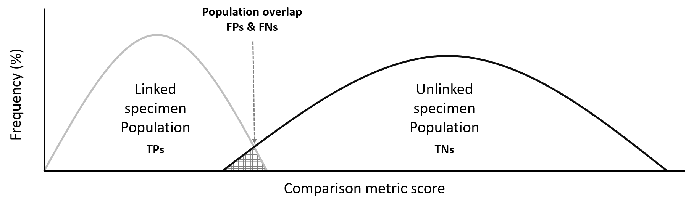

# Prioritisation of analytical techniques
Use of Receiver Operating Characteristic (ROC) curves to prioritise analytical techniques used for illicit drug profiling

## Description
The following code reads in simulated data (*original data cannot be disseminated*) for illicit drug specimens, which have been profiled through several analytical techniques. The code then performs a target variable selection, pre-treatment (PT), runs multiple comparison metrics (CM) and takes into account different rules for defining specimen populations (PR). The area under the ROC curve is calculated for each combination of PT and CM to determine the optimal combination, i.e. highest area under the ROC curve. The optimal combination of PT and CM is compared across analytical techniques to determine which technique provides the most discrimination between illicit drug profiles, hence allowing techniques to be prioritised based on their level of discrimination power.

  

*Figure 1: Process for identifying the optimal comparison process for a profile type (i.e. analytical technique).*


## Significance
This project looked at prioritising the analytical techniques currently used for methylamphetamine (MA) profiling in Australia, to generate timely results. The analytical techniques (i.e. *GC-MS* - by-products, *IRMS* - isotopes and *CE* - enantiomers) used in the profiling method generate information relating to different parts of the MA manufacturing process [1]. Although all this information is valuable in its own way, timely intelligence products can be generated from one profiling technique [2]. As some profiles provide superior discrimination between specimens, their extraction from illicit drug specimens should be prioritised [2].


## Usage
#### **Reading in the data and basic tidying:**
```{r, message=FALSE}
#Load the required libraries
library(openxlsx)
library(tidyverse)
library(ggplot2)
library(ggcorrplot)
library(pROC)
library(ggh4x)

#Importing the Lookup table (contains data about Specimens (i.e. Seizure, Date, Purity, Precursor, etc.)
Lookup <-  read.xlsx("Data/Profiles.xlsx", sheet = "Lookup", rowNames = F, colNames = T, detectDates = T)

#Importing Gas Chromatpgraphy Mass Spectometry data
GCMS <-  as.data.frame(read.xlsx("Data/Profiles.xlsx", sheet = "GCMS", rowNames = T, colNames = T))

#Importing Isotopic Ratio Mass Spectrometry data
IRMS <-  as.data.frame(read.xlsx("Data/Profiles.xlsx", sheet = "IRMS", rowNames = T, colNames = T))

#Importing Capillary Electrophoresis data
CE <- as.data.frame(read.xlsx("Data/Profiles.xlsx", sheet = "CE", rowNames = T, colNames = T))
```

#### **Choosing target variables for GCMS profiles:**
Not all variables contribute equally to the GCMS specimen profiles and should be removed if they are deemed to be redundant. This was achieved through applying the following criteria; optimal target variables (1) must be present in most specimens at a sufficient concentration; (2)  must have a small intra-variability for specimens within seizures and large inter-variability for specimens between seizures; (3) should be uncorrelated to each other [3]. As the IRMS and CE datasets contained 3 and 2 variables respectively, it was decided to not reduce these datasets any further. **Only the GCMS dataset was subject to variable reduction.** 

**(1) Presence of variables in all specimens**
```{r}
#Bar plot of target variables presence in specimens
Count <- data.frame(Variables = colnames(GCMS),
                   Percentage = round((colSums(GCMS !=0)/nrow(GCMS)), digits = 5),
                   row.names = NULL)

Bar <- ggplot(Count, aes(Variables, Percentage*100)) +
  geom_bar(stat = "identity") +
  theme_light()+
  theme(axis.title.x = element_text(face="bold",size = 12,margin=margin(10,0,0,0)),
        axis.title.y = element_text(face="bold",size = 12,margin=margin(0,10,0,0)),
        axis.text.y = element_text(size = 10),
        axis.text.x = element_text(size = 10, vjust = 0.5),
        panel.grid = element_blank(),
        panel.background=element_rect(fill=NA),
        legend.position = "none")+
  scale_y_continuous("Percentage of specimens (%)")  +
  coord_cartesian(ylim = c(0,100))
Bar  
```

*Figure 2: Presence of variables in GCMS specimens*

The presence of variables in each specimen needs to be identified as it common for these variables not to be detected [3], whether that be due to the limit of detection of the analytical instrument or the target variable simply being absent. As shown in Figure 2, all variables were present in more than 25% of specimens meaning that none of the vairables are redundant with respect to this criterion.

**(2) Intra-variability and inter-variability of variables**
```{r}
Specimen_List <- data.frame(row.names = rownames(GCMS))
Specimen_List$Group <- Lookup$Group[match(row.names(Specimen_List),Lookup$Specimen)]
Specimen_List$Count <- plyr::count(Specimen_List,"Group")$freq[match(Specimen_List$Group,plyr::count(Specimen_List,"Group")$Group)]

Lkd <- lapply(c("G_158","G_030","G_162","G_285"),function(SG){
  X = stack(subset(GCMS, row.names(GCMS) %in% row.names(Specimen_List[Specimen_List$Group==SG,])))
  X$Group = rep(SG,nrow(X))
  return(X)
})
ULkd <-  stack(subset(GCMS, row.names(GCMS) %in% row.names(Specimen_List[Specimen_List$Count==1,])))
ULkd$Group <- rep("Multiple",nrow(ULkd))
Group.labs <- c("Inter-variability",
                "Intra-variability of Group B",
                "Intra-variability of Group A",
                "Intra-variability of Group C",
                "Intra-variability of Group D")
names(Group.labs) <- c("Multiple","G_158","G_030","G_162","G_285")

BoxP <- rbind(do.call(rbind,Lkd),ULkd)

psplit <- ggplot(BoxP, aes(x = ind,y = values)) + 
  geom_boxplot(outlier.shape = 1,outlier.size = 1,lwd = 0.3) +
  facet_wrap(~ Group, scale = "free_y", ncol=1, labeller = labeller(Group = Group.labs)) +
  labs(x="Target variables",y="Pre-treated variable intensity") +
  theme_light()+
  theme(axis.title.x = element_text(face="bold", size = 12, margin = margin(10,0,0,0)),
        axis.title.y = element_text(face="bold", size = 12, margin = margin(0,10,0,0)),
        axis.text.y = element_text(size = 10),
        axis.text.x = element_text(size = 10, angle = 0, vjust = 0.5),
        strip.text = element_text(size = 10, face = "bold"),
        legend.position = "none",
        panel.grid.major = element_blank(),
        panel.grid.minor = element_blank())
psplit
```

*Figure 3: Inter-variability and intra-variability of GCMS variables, several large seizures were selected to visualise the intra-variability*

As well as assessing the presence of variables in specimens, the intra- and inter-variability was evaluated. Boxplots were selected as the visualisation method to support interpretation of the data. Several larger seizures were selected to visualise the intra-variability, they can be seen in Figure 3. The inter-variability is represented by single specimen seizures assumed to be unlinked to each other. 
Through this criterion it was decided to only exclude variables which exhibited very small intra- and inter-variability, as they would only provide minimal discrimination between specimens; this included variable 10 (i.e. V10).

**(3) Correlation of variables**
```{r}
M = cor(GCMS, method = "spearman")
corrplot <- ggcorrplot(M, method = "square", type = "upper", outline.col = "white", lab = TRUE, 
                       p.mat = ggcorrplot::cor_pmat(M, method = "spearman"), insig = "blank",
                       colors = c("#6D9EC1", "white", "#E46726")) +
  theme(axis.text.y = element_text(size = 10),
        axis.text.x = element_text(size = 10, angle = 0, vjust = 0.5),
        panel.grid.minor = element_blank())
corrplot
```

*Figure 4: Rho Spearman correlation coefficients between GCMS variables*

The correlation between variables was evaluated through Rho Spearman correlation coefficients and respective p-values, the correlation between all variables can be seen in Figure 4. It should be noted that a correlation coefficient above an absolute value of 0.7 is generally considered to be strong [4]. Of the correlations which are statistically significant none of the correlation values are above an absolute value of 0.7. It was decided to not remove any variables considering thet results of this criterion. 

In summary, it was decided to only remove V10 from subsequent analysis due to the results of the second criterion.
```{r}
# Extracting the chosen target variables for subsequent analysis
GCMS_TV <- GCMS %>% select(!V10)
```


#### **Optimisation of the linked and unlinked specimen populations:**
**Background:** Many questions have been raised by law enforcement and the judicial system regarding both the determination of an association between objects and/or their classification [5]. To determine the level of association between profiles, CMs can be applied to pre-treated data. A range of CM and PT combinations have been applied in the area of illicit drugs [6]. The optimum combination of CM and PT will ensure the greatest separation between linked (specimens from the same seizure) and unlinked (specimens from differnt seizures) populations. Optimising the seperation between the two populations in turn minimises false positive (FP) and false negative (FN) specimen linkages.



*Figure 5: An example of the distribution of linked and unlinked specimen scores; orientation of linked and unlinked populations may vary with the comparison metric used*

It was discovered that there was a large intra-variability between the MA specimens, which caused a large overlap between the linked and unlinked distributions. For this reason, it was decided to test several rules for defining the two populations (PR) to see how they would affect their seperation. The rules are defined as follows:

Rule|Linked Population|Unlinked Population
-|-|-
R1|specimens from the same seizure|specimens from different seizures
R2|specimens from the same seizure, which contained two to ten specimens|seizures with only one specimen
R3|specimens from the same seizure, primary route, precursor and precursor route|specimens from different seizures and specimen pairs are excluded if they have the same primary route, precursor or precursor route
R4|specimens from the same seizure, which contained two to ten specimens, and specimen pairs must have the same primary route, precursor and precursor route|specimens from different seizures and specimen pairs are excluded if they have the same primary route, precursor or precursor route

For the full list of PTs, CMs and PRs used in this analysis please see the "DataOptFunctions.R" file.

**A GCMS example - defining the optimal combination of PT, CM and PR**
```{r}
# Reading in several functions needed for subsequent analysis
source("Files/DataOptFunctions.R", local = T)

# Applying pre-treatments
GCMS_TV_N <- GCMS_TV/rowSums(GCMS_TV)
GCMS_TV_N2R <- GCMS_TV_N^0.5
GCMS_TV_N4R <- GCMS_TV_N^0.25

# Applying population rules and comparison metrics to the pre-treated data
GCMS_PT_CM_R <-  
  lapply(  
    list(N=GCMS_TV_N,N2R=GCMS_TV_N2R,N4R=GCMS_TV_N4R), 
    function(X){
      lapply(
        list(CAN=CAN,EUC=EUC,MAN=MAN,MCF=MCF,PCC=PCC),
        function(CM,PT){
          list(
            R1 = R1(CM(as.matrix(PT))),
            R2 = data.frame(R2(CM(L(PT)),CM(U(PT)))),
            R3 = R3(CM(as.matrix(PT))),
            R4 = data.frame(R4(CM(L(PT)),CM(as.matrix(PT)))))
        },
        PT=X)
    })

# Adding in comparison metric and pupulation rule info - for boxplot viz
for(i in 1:length(GCMS_PT_CM_R)){
  for(j in 1:length(GCMS_PT_CM_R[[1]])){
    for(k in 1:length(GCMS_PT_CM_R[[1]][[1]])){
      GCMS_PT_CM_R[[i]][[j]][[k]]$Freq = (GCMS_PT_CM_R[[i]][[j]][[k]]$Freq/max(GCMS_PT_CM_R[[i]][[j]][[k]]$Freq))*100
      GCMS_PT_CM_R[[i]][[j]][[k]]$PT = rep(c("N","N2R","N4R")[i],nrow(GCMS_PT_CM_R[[i]][[j]][[k]]))
      GCMS_PT_CM_R[[i]][[j]][[k]]$CM = rep(c("CAN","EUC","MAN","MCF","PCC")[j],nrow(GCMS_PT_CM_R[[i]][[j]][[k]]))
      GCMS_PT_CM_R[[i]][[j]][[k]]$R = rep((paste0("R",k)),nrow(GCMS_PT_CM_R[[i]][[j]][[k]])) 
    }
  }
}

# Extracting the area under curve (AUC) of each reciever operating characteristic (ROC) calculation
GCMS_PT_CM_R <- do.call(rbind,do.call(rbind,do.call(rbind,GCMS_PT_CM_R)))

GCMS_AUC <- GCMS_PT_CM_R %>% 
  group_by(PT,CM,R) %>% 
  group_map(~{roc(.x$label, .x$Freq, levels = c("Inter", "Intra"), direction = ">")$auc})

GCMS_ROC <- data.frame(AUC = unlist(GCMS_AUC)) %>% bind_cols(GCMS_PT_CM_R %>% distinct(PT,CM,R))

# Defining the optimal comparison metric and population rule based on the ROC AUC
OPT_GCMS_AUC <- max(GCMS_ROC$AUC)
OPT_GCMS_PT <- GCMS_ROC[which.max(GCMS_ROC$AUC),"PT"]
OPT_GCMS_CM <- GCMS_ROC[which.max(GCMS_ROC$AUC),"CM"]
OPT_GCMS_PR <- GCMS_ROC[which.max(GCMS_ROC$AUC),"R"]

OPT_GCMS_PT_CM_R <- GCMS_PT_CM_R %>%
  filter(PT == OPT_GCMS_PT,
         CM == OPT_GCMS_CM,
         R == OPT_GCMS_PR)
```

For the GCMS dataset the optimal values are as follows:

Measure|Value
-|-
PT|N4R
CM|PCC
PR|R4

```{r, fig.dim=c(8,10)}
# Visualising the seperation between linked and unlinked populations for each CM and PR combination
ggplot(GCMS_PT_CM_R, aes(x=label, y=Freq)) + 
  geom_boxplot(outlier.shape=1,outlier.size=1) + 
  facet_nested(PT+CM~R, scales="free")+
  labs(y="CM score")+
  scale_fill_manual(values=c("white","white"))+
  theme_light()+
  theme(legend.position="none",
        axis.title.y=element_text(face="bold"), 
        axis.title.x=element_blank(),
        strip.text=element_text(face="bold"),
        panel.grid.major=element_blank(),
        panel.grid.minor=element_blank())
```

*Figure 6: Inter- and intra-variability of scores between ENIPID GC-MS profiles for combinations of PTs, CMs and PRs*

**Visualising the optimal seperation between populations**
```{r}
# Density plot of the optimal CM and PR combination
ggplot(OPT_GCMS_PT_CM_R,aes(x=Freq,colour=label))+
  geom_density()+
  coord_cartesian(xlim = c(0,100))+
  labs(x="CM score",y="Frequency (%)")+                          
  scale_color_grey()+
  theme_light()+
  theme(plot.title=element_text(face="bold",hjust=.5),
        axis.title=element_text(face="bold"),
        legend.title=element_blank(),
        legend.position="none",
        panel.grid.major=element_blank(),
        panel.grid.minor=element_blank())

```

*Figure 7: Optimised distribution of intra-variability (grey line) and inter-variability (black line) of ENIPID GC-MS profiles, using the N4R/PCC/R4 combination*

**IRMS and CE - defining the optimal combination of PT, CM and PR**

Following the same method applied to the GCMS dataset the optimal values for IRMS and CE are as follows:

IRMS:

Measure|Value
-|-
PT|L
CM|MAN
PR|R2

CE:

Measure|Value
-|-
PT|N4R
CM|MAN
PR|R3

**Prioritising analytical techniques based on their optiimal area under the ROC curves**

The optimal combinations of PT, CM and PR generated the following AUC ROC for each analytical technique:

Technique|AUC
-|-
GCMS|0.980
IRMS|0.732
CE|0.545

It was found that the GCMS data was the most discriminative out of the three analytical techniques. 

## Summary of results
In summary, it was found that the GC-MS data was the most discriminative out of the three analytical techniques. This was determined though the area under the ROC curve values for the optimised PT/CM/VRR combination of each analytical technique. In short, those values were 0.980 for GC-MS via N4R/PCC/R4, 0.732 for IRMS via L/MAN/R2 and 0.545 for CE profiles via N4R/MAN/R3. 

Although all these profile types are useful individually (e.g. generate information relating to different parts of the manufacturing process) [1], they do not need to be acquired and used concurrently to obtain timely intelligence [2]. In a previous study, it was demonstrated that a single profiling technique could be prioritised to contribute more effectively to the generation of timely intelligence [2]. In this instance a similar result was obtained, it was shown that GC-MS could be prioritised ahead of IRMS and CE techniques. 


## Author 
Ana Popovic - [popovicana](https://github.com/PopovicAna)


## Acknowledgements
This work is supported by an Australian Research Council grant (LP160100352).

## References
1. Collins, M., et al., Illicit drug profiling: the Australian experience. Australian Journal of Forensic Sciences, 2007. 39(1): p. 25-32. 
2. Morelato, M., et al., The use of organic and inorganic impurities found in MDMA police seizures in a drug intelligence perspective. Sci Justice, 2014. 54(1): p. 32-41.
3. Morelato, M., Forensic drug profiling: A tool for intelligence-led policing. 2015
4. Moore, D.S., Chapter 5. Regression, in The Basic Practice of Statistics. 2010, Freeman. p. 157.
5. Zadora, G., Chemometrics and Statistical Considerations in Forensic Science, in Encyclopedia of Analytical Chemistry. 2006, John Wiley & Sons, Ltd.
6. Popovic, A., et al., Review of the most common chemometric techniques in illicit drug profiling. Forensic Science International, 2019. 302: p. 109911.
