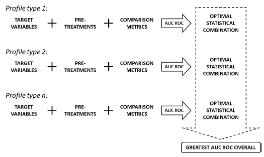

# Prioritisation of analytical techniques
Use of Receiver Operating Characteristic (ROC) curves to prioritise analytical techniques used for illicit drug profiling

## Description
The following code reads in simulated data (*original data cannot be disseminated*) for illicit drug specimens, whcih have been pprfiled through several analytical techniques. The code then performs a target variable selection, pre-treatment (PT), runs multiple comparison metrics (CM) and takes into account different rules for defining specimen populations. The area under the ROC curve is calculated for each combination of PT and CM to determine the optimal combination, i.e. highest area under the ROC curve. The optimal combination of PT and CM is compared across analytical techniques to determine which technique provides the most discrimination between illicit drug profiles, hence allowing techniques to be prioritised based on their level of discrimination power.



## Significance
This project looked at prioritising the analytical techniques currently used for methylamphetamine (MA) profiling in Australia, to generate timely results. The analytical techniques (i.e. *GC-MS* - by-products, *IRMS* - isotopes and *CE* - enantiomers) used in the profiling method generate information relating to different parts of the MA manufacturing process [59]. Although all this information is valuable in its own way, timely intelligence products can be generated from one profiling technique [36]. As some profiles provide superior discrimination between specimens, their extraction from illicit drug specimens should be prioritised [36].

  **INCLUDE IMAGE**

## Usage
#### **Reading in the data and basic tidying:**
```{r}
#Load the required libraries
library(openxlsx)
library(tidyverse)
library(ggplot2)

#Importing the lookup table
lookup <-  read.xlsx("Data/Profiles.xlsx", sheet = "Lookup", rowNames = F, colNames = T, detectDates = T)

#Importing Gas Chromatpgraphy Mass Spectometry data and removing specimens with 2 or less variables
GCMS <-  as.data.frame(read.xlsx("Data/Profiles.xlsx", sheet = "GCMS", rowNames = T, colNames = T))
GCMS <-  GCMS[!rowSums(GCMS!=0)<=2,]

#Importing Isotopic Ratio Mass Spectrometry data
IRMS <-  as.data.frame(read.xlsx("Data/Profiles.xlsx", sheet = "IRMS", rowNames = T, colNames = T))

#Importing Capillary Electrophoresis data
CE <- as.data.frame(read.xlsx("Data/Profiles.xlsx", sheet = "CE", rowNames = T, colNames = T))
```

#### **Choosing target variables for GCMS profiles:**
This section of the code removes redundant target variables from the dataset. This was achieved through applying the following criteria; optimal target variables (1) must be present in most specimens at a sufficient concentration; (2)  must have a small intra-variability for specimens within seizures and large inter-variability for specimens between seizures; (3) should be uncorrelated to each other [18, 94]. As the IRMS and CE datasets acontained 3 and 2 variables respectively, it was decided to not reduce these datasets any further. **Only the GCMS dataset was subject to variable reduction.** 

**(1) Presence of variables in all specimens**
```{r}
#Bar plot of target variables presence in specimens
Count <- data.frame(Variables = colnames(GCMS),
                   Percentage = round((colSums(GCMS !=0)/nrow(GCMS)), digits = 5),
                   row.names = NULL)

Bar <- ggplot(Count, aes(Variables, Percentage*100)) +
  geom_bar(stat = "identity") +
  theme_light()+
  theme(axis.title.x = element_text(face="bold",size = 12,margin=margin(10,0,0,0)),
        axis.title.y = element_text(face="bold",size = 12,margin=margin(0,10,0,0)),
        axis.text.y = element_text(size = 8),
        axis.text.x = element_text(size = 8, angle = 90, vjust = 0.5),
        panel.grid = element_blank(),
        panel.background=element_rect(fill=NA),
        legend.position = "none")+
  scale_y_continuous("Percentage of specimens (%)")  +
  coord_cartesian(ylim = c(0,100))
Bar
```

**(2) Intra-varaibility and inter-variability of variables**
```{r}
Specimen_List <- data.frame(row.names = rownames(GCMS))
Specimen_List$Group <- lookup$Group[match(row.names(Specimen_List),lookup$Specimen)]
Specimen_List$Count <- plyr::count(Specimen_List,"Group")$freq[match(Specimen_List$Group,plyr::count(Specimen_List,"Group")$Group)]

Lkd <- lapply(c("G_158","G_030","G_162","G_285"),function(szn){
  X = stack(subset(GCMS, row.names(GCMS) %in% row.names(Specimen_List[Specimen_List$Group==szn,])))
  X$Group = rep(szn,nrow(X))
  return(X)
})
ULkd <-  stack(subset(GCMS, row.names(GCMS) %in% row.names(Specimen_List[Specimen_List$Count==1,])))
ULkd$Group <- rep("Multiple",nrow(ULkd))
Group.labs <- c("Inter-variability",
              "Intra-variability of Group A (n = 9)",
              "Intra-variability of seizure B (n = 10)",
              "Intra-variability of seizure C (n = 8)",
              "Intra-variability of seizure D (n = 9)")
names(Group.labs) <- c("Multiple","G_158","G_030","G_162","G_285")

BoxP <- rbind(do.call(rbind,Lkd),ULkd)

psplit <- ggplot(BoxP, aes(x=ind,y=values)) + 
  geom_boxplot(outlier.shape=1,outlier.size=1,lwd=0.3) +
  facet_wrap(~Group, scale= "fixed", ncol=1, labeller = labeller(Group=Group.labs)) +
  labs(x="Target variables",y="Pre-treated variable intensity") +
  theme_light()+
  theme(axis.title.x = element_text(face="bold",size = 12,margin=margin(10,0,0,0)),
        axis.title.y = element_text(face="bold",size = 12,margin=margin(0,10,0,0)),
        axis.text.y = element_text(size = 8),
        axis.text.x = element_text(size = 8, angle = 0, vjust = 0.5),
        strip.text=element_text(face="bold"),
        legend.position="none",
        panel.grid.major = element_blank(),
        panel.grid.minor = element_blank())
psplit
```

**(3) Correlation of variables**
```{r}
M = cor(GCMS,method = "spearman")
library(ggcorrplot)
corrplot <- ggcorrplot(M, type = "upper",outline.col = "white", p.mat = ggcorrplot::cor_pmat(M),
           colors = c("#595959", "white", "#595959"))+
  theme(axis.text.y = element_text(size = 8),
        axis.text.x = element_text(size = 8, angle = 0, hjust = 0.5),
        panel.grid.minor = element_blank())
corrplot
```

#### **Optimisation of the linked and unlinked specimen populations:**
The newly defined GCMS target variables
Define linked (intra-variability) and unlinked (inter-variability). 
It was discovered that there was a large intra-variability between the MA specimens, which caused a large overlap between the linked and unlinked distributions.
```{r}
source("DataOptFunctions.R", local = T)

```


## Results
The analytical technique with the greatest discrimination was found to be GCMS, with IRMS second and CE following. 


## Author 
Ana Popovic - [popovicana](https://github.com/PopovicAna)

## Licence


## Acknowledgements
This work is supported by an Australian Research Council grant (LP160100352).


