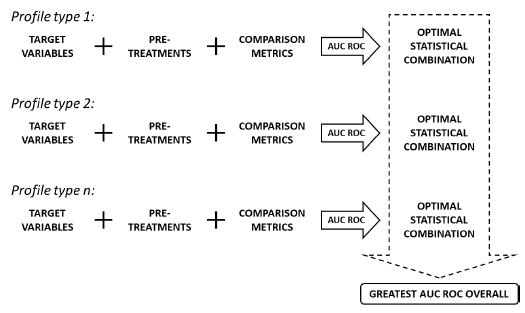

# Prioritisation-of-analytical-techniques
Use of Reciever Operating Characteristic (ROC) curves to prioritise analytical techniques used for illicit drug profiling

## Description
The following program reads in simulated drug profiling data (original data cannot be diseminated), performs a target variable selection, pre-treatment (PT) and runs multiple comparison metrics (CM) on the data. The area under the ROC curve is calculated for each combination of PT and CM to determine the optimal combination, i.e. highest area under the ROC curve. The optimal combination of PT and CM is compared across analytical techniques to determine which technique provides the most discrimination between illicit drug profiles, hence allowing techniques to be prioritised based on their level of discrimination power.

## Significance
To generate timely results, this project looked at prioritising the analytical techniques currently used for methylamphetamine (MA) profiling in Australia. The analytical techniques (i.e. GC-MS, IRMS and CE) used in the profiling method generate information relating to different parts of the MA manufacturing process [59]. Although all this information is valuable in its own way, in previous research it was demonstrated that timely intelligence products could be generated from one profiling technique [36]. As some profiles provide superior discrimination between populations of linked and unlinked specimens, their extraction from subsequent illicit drug specimens should be prioritised [36].

## Usage

## Author 
Ana Popovic - [popovicana](https://github.com/PopovicAna)

## Licence

## Acknowledgements
This work is supported by an Australian Research Council grant (LP160100352).
